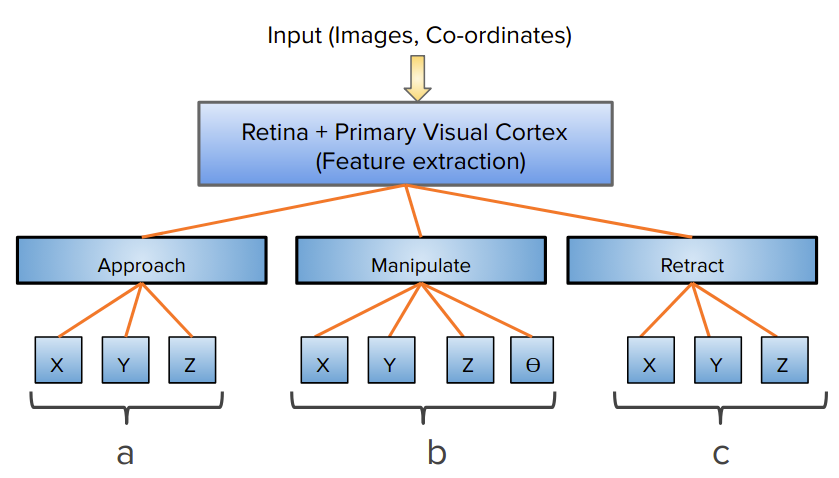
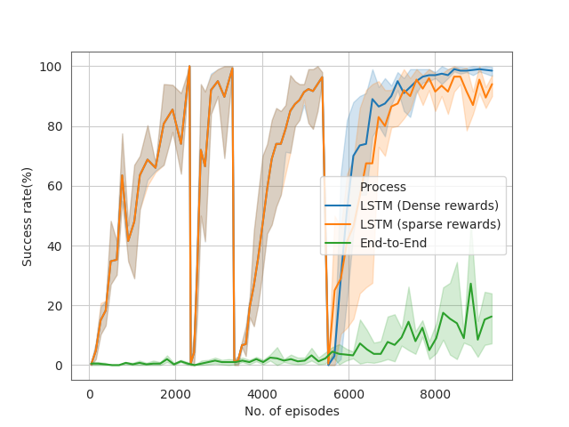

# Reactive-Reinforcement-learning

A framework to generate reactive behaviours, motivated from Subsumption architecture from 1980s. In our archihtecture each  behaviour is represented as a separate module (Deep network), having direct access to processed sensory information. Each module has an individual specific goal. We use a trivial form of imitation learning, called Behaviour cloning, to train these distinct behaviour layers.

 
## Implementation details
Here, we use the OpenAI simulator FetchPickandPlace which provides kinematic state vector as an input to our network.
For installing OpenAI fetch simulator: Refer to [Fetch](https://openai.com/blog/ingredients-for-robotics-research/)

### Step 1: Train on approach
## Results

Comparison of end-to-end learning vs proposed reactive Reinforcement architecture.

 
